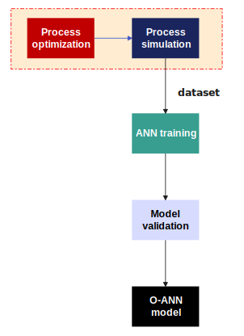
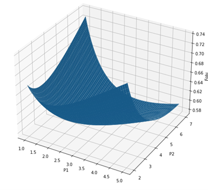
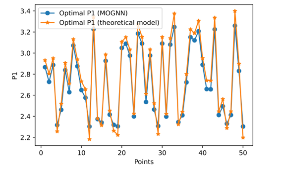
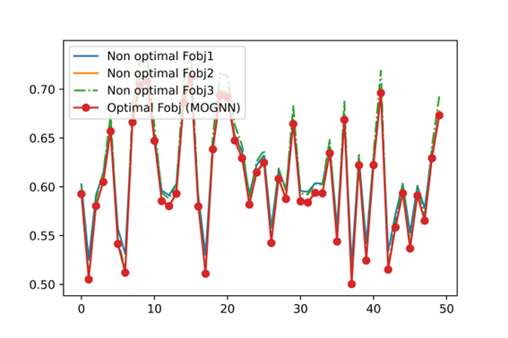

# Model-Optimization-guided Neural Networks

## Introduction
In this repository, we provide the algorithms developed in the strategy "Model Optimization-guided Neural Networks" [MOGNN]. The strategy is based on two steps: [i] optimization of a physical model, using the algorithm Particle Swarm Optimization [PSO] and [ii] neural network training with optimized data.
In this work, the goal is to apply approximate models for the optimization of chemical processes. In the proposed strategy, steady-state optimization is performed in a pre-training step, as shown in figure below. The steps can be divided into [1] data collection: process simulation-optimization, [2] ANN training, [3] model validation and [4] application of the ANN model.

  

The codes, developed in python language, are divided into two parts: [a] optimize.py and [b] ann_training.py. The optimize.py file optimizes a given physical model for different scenarios (input variables). This routine generates, thus, an optimal data set, with independent variables (input variables) and optimized decision variables (output variables). The ann_training.py file imports the data from the routine [a] and feeds into a neural network training algorithm. Therefore, the optimal decision variables are the targets for neural network training.

## Requirements
To solve models that require simulation software of chemical processes, one must have the license of Hysys@ or Unisim Design@. In Python the numpy, scipy and keras libraries are necessary. 

## Example

Minimize the objective function:

$$
\min_{P_{\text{1,2}}} \left[ \left(\frac{P_1}{P_0}\right)^{0.286} + \left(\frac{P_2}{P_1}\right)^{0.286} + \left(\frac{P_3}{P_2}\right)^{0.286} - 3.0 \right]
$$

subject to:

$$
P_1, P_2 > 0
$$

$$
P_4 = 4
$$

The system is optimized for different values of $$P_0 \in[1,2] $$. 

  

The training was performed by the optimization of 50 cases, with $$P_0 \in[1,2] $$. The optimal values of $$P_1$$ and $$P_2$$ are displayed in the following figures:

  

MOGNN was tested for 50 cases, with new Po values. The optimal values predicted by the model were fed back into the model to compute the value of the objective function for each case. The results were compared with three "non-optimal" objective function scenarios, as shown in the following figure:

  

Notice that the MOGNN was able to compute the lowest objective-function values compared to three non-optimal cases: (I)   $$P_0 =1 $$ and  $$P_1 = 2$$; (II)  $$P_o = 1.2 $$ and  $$P_1 = 1.8 $$; and (III) $$P_o = 1.7$$ and $$ $$P_1 = 2.1 $$. 
